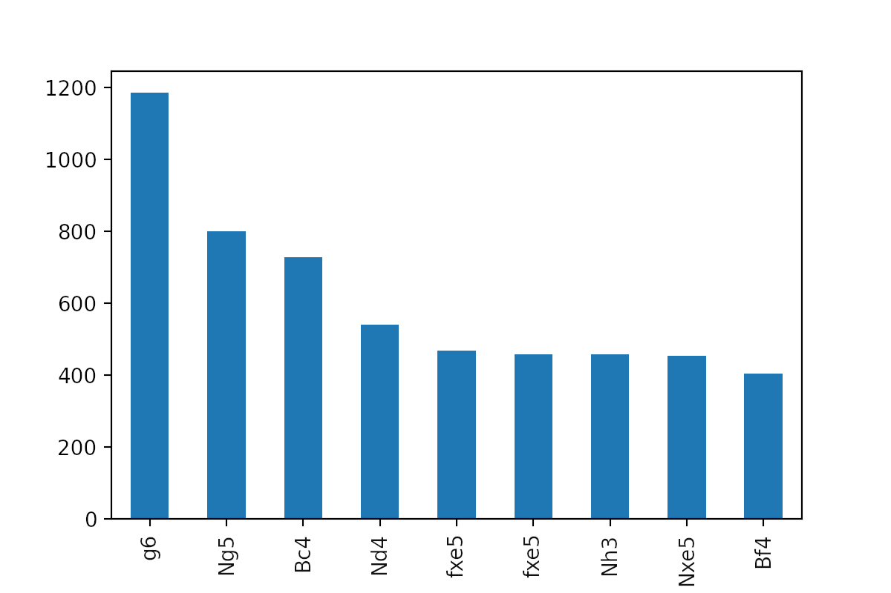
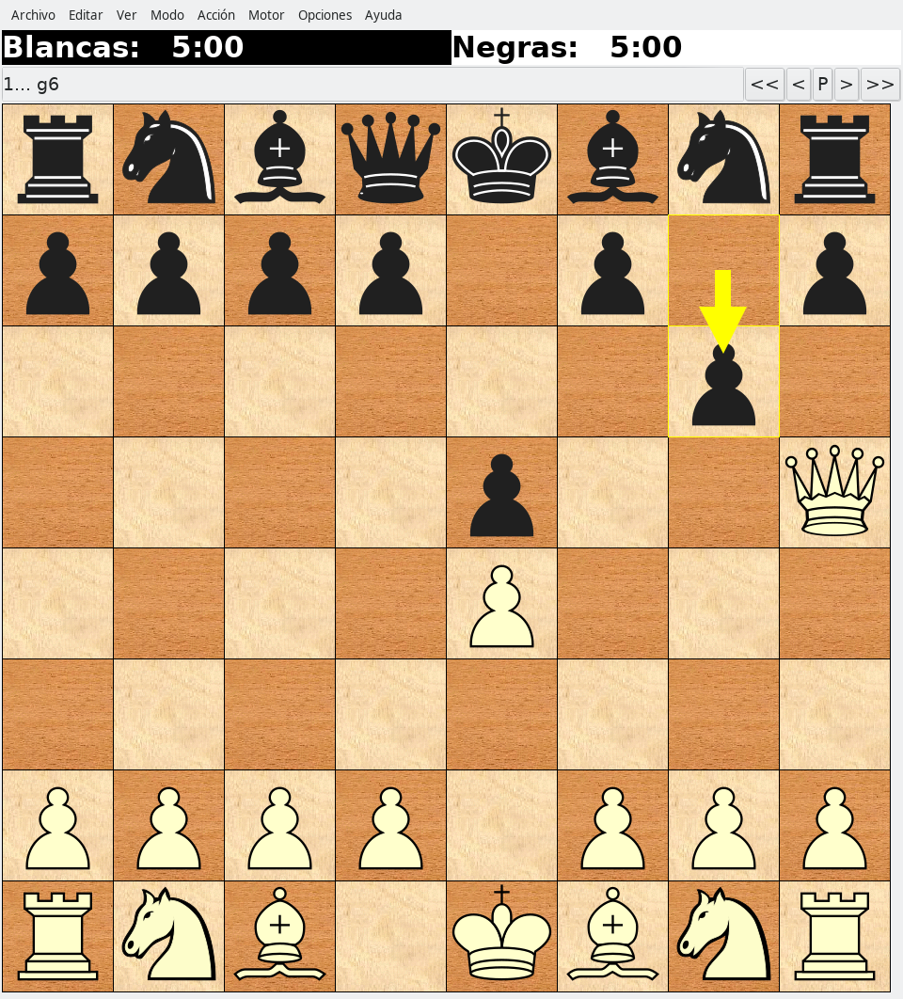
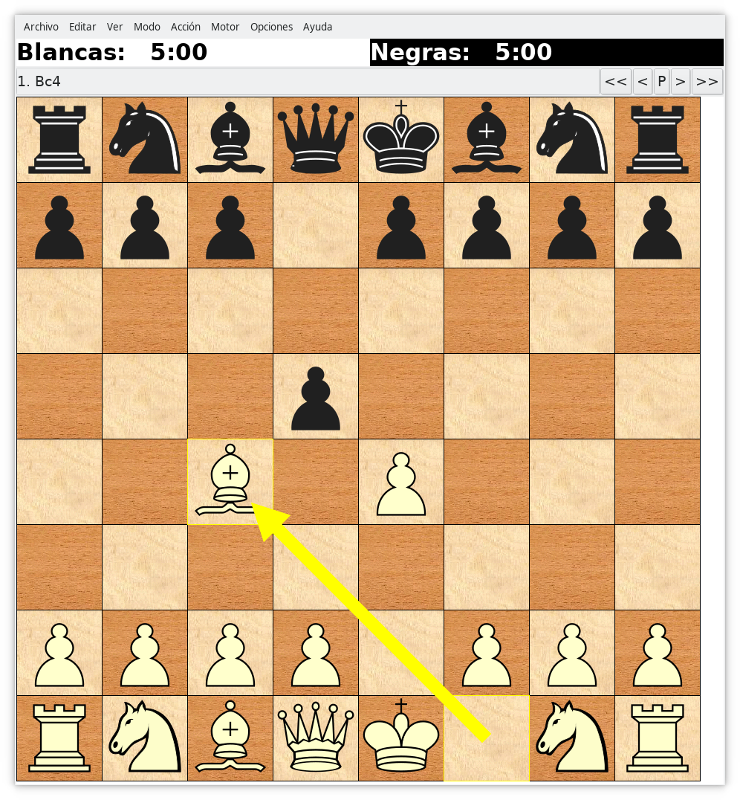
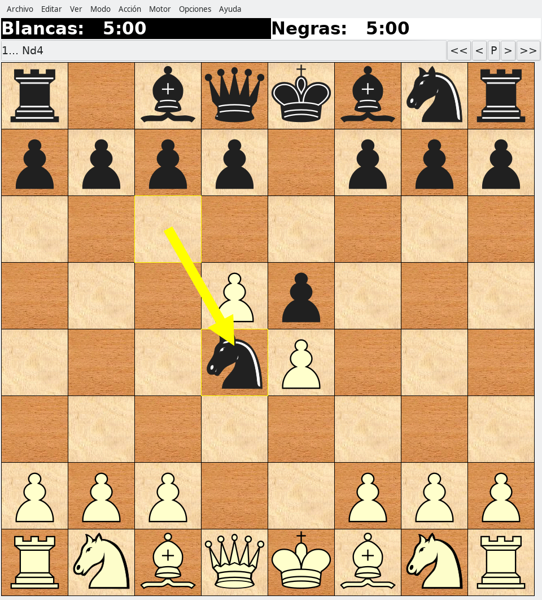
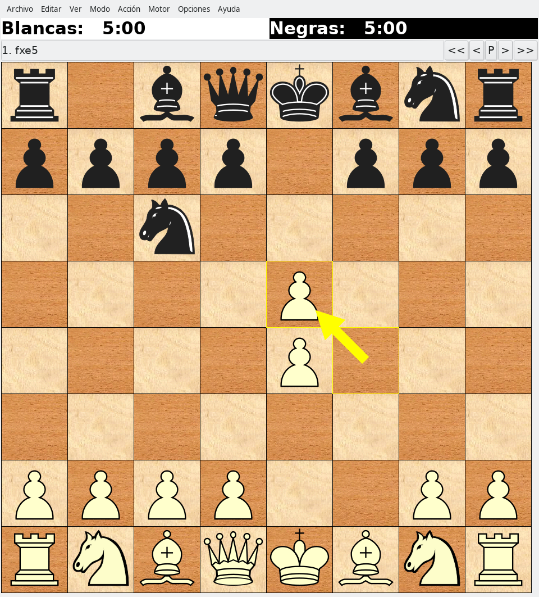
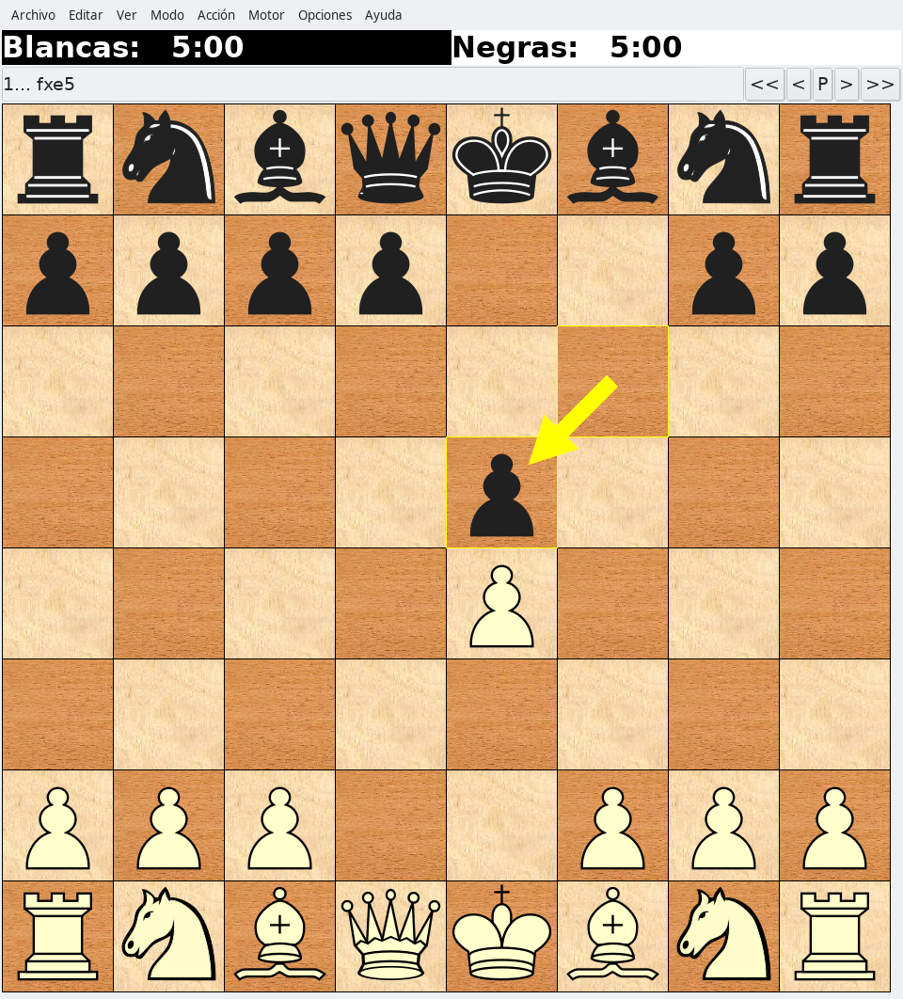
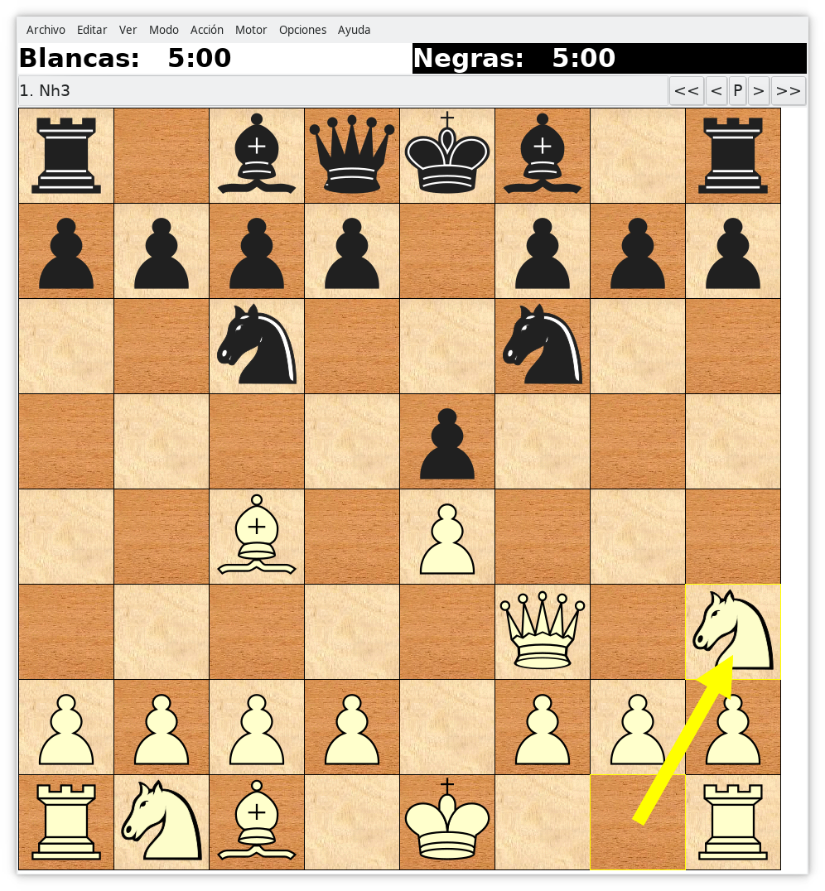
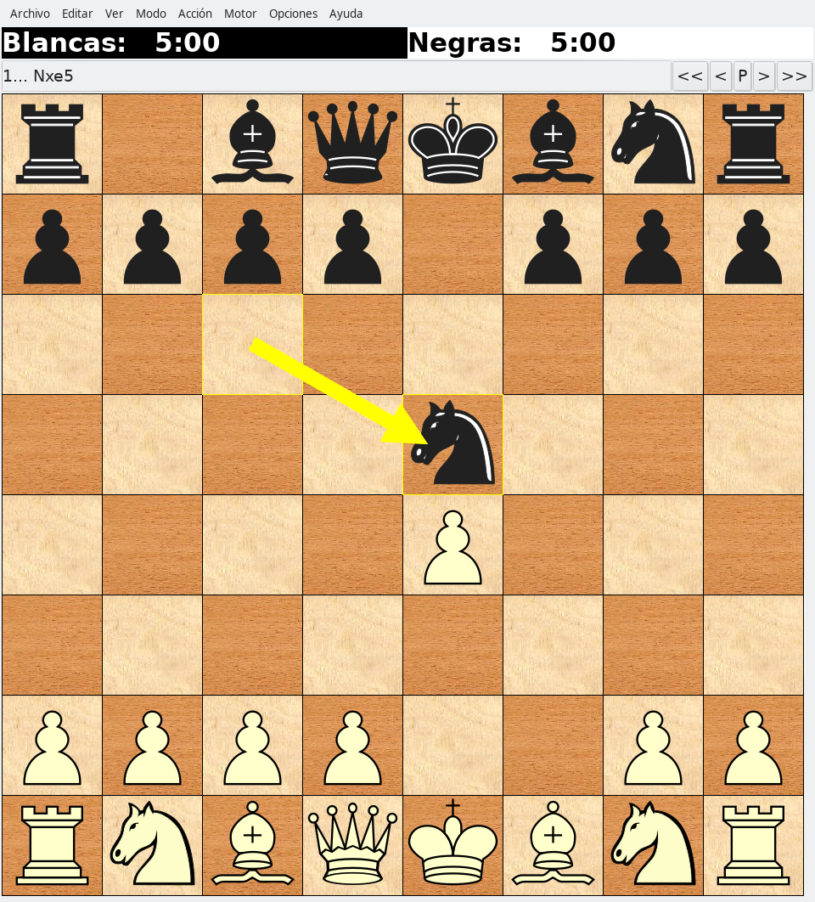
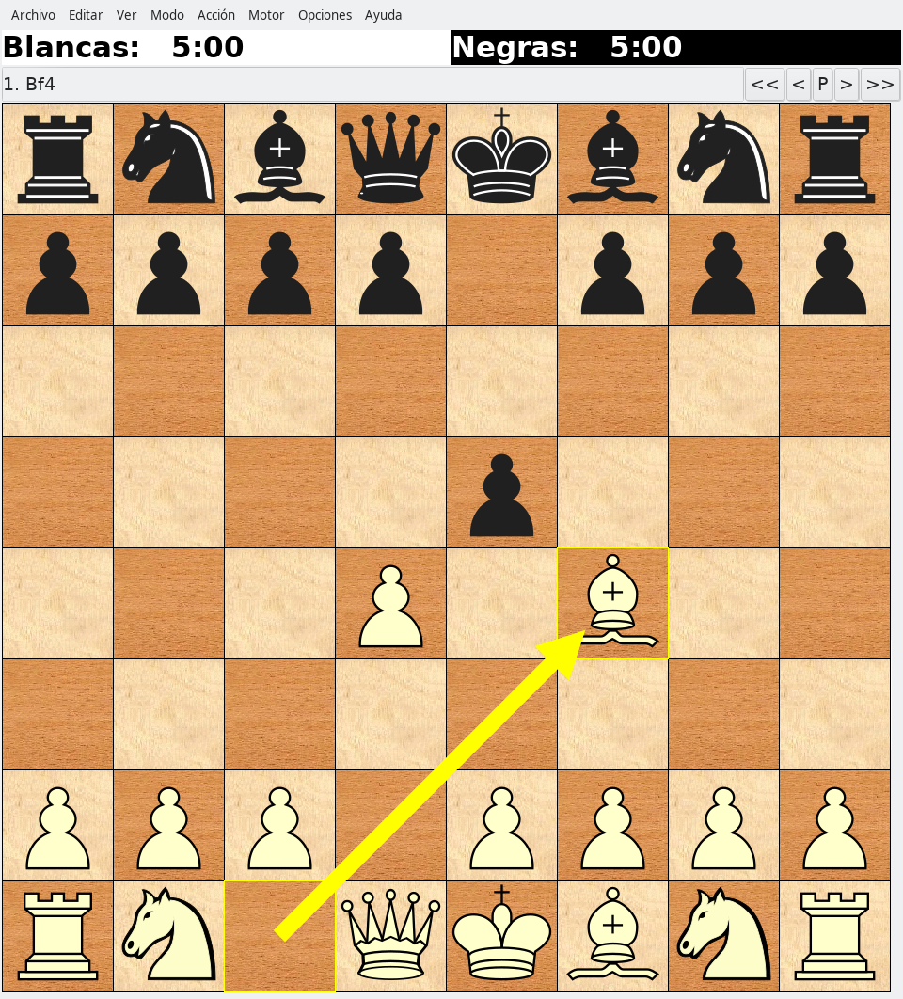

# Chess Blunders

Analyzing the most common chess blunders.

## How to recreate the results

Just:

```
make create_environment # and activate the environment:
source venv/bin/activate
make requirements
./src/data/wget_data.sh # or download only the months you want from https://database.lichess.org
make data
```

The `make data` step takes a long time, so I'd recommend to run it on a server or maybe run it in two steps (`make data_interim` and then `make data_processed`).

<details>
<summary><b>Unfold this</b> to see screenshots and screencasts about the process</summary>
<h2 id="-download-and-filter-only-evaluated-games">- Download and filter only evaluated games</h2>
<p><a href="https://asciinema.org/a/421249"></a></p>
<h4 id="all-data-only-the-first-4m-evaluated-games-for-each-month-in-2020-and-2021-has-been-processed-but-that-s-enough-">All data (only the first 4M evaluated games for each month in 2020 and 2021 has been    processed, but that's enough):</h4>
<p><a href="https://mastodon.social/@jartigag/106364603081282594"></a></p>
<h2 id="-preprocess-get-blunders-parallelizing-1m-per-core-">- Preprocess: get blunders (parallelizing 1M per core)</h2>
<p>At now, this step requires manual intervention:</p>
<pre><code>./src/<span class="hljs-title">data</span>/split_first_4M.sh
<span class="hljs-comment"># manually, fix the end and beginning of each file, so the pgn keeps a correct format</span>
</code></pre><p><a href="https://mastodon.social/@jartigag/106325214993618150"></a></p>
<h4 id="resulting-interim-data">Resulting interim data</h4>
<p><a href="https://asciinema.org/a/414643"></a></p>
<h2 id="-aggregate-and-visualize-most-common-blunders">- Aggregate and visualize most common blunders</h2>
<p>I should integrate this in <code>src/visualization/</code>, but until then:</p>
<pre><code><span class="hljs-built_in">cd</span> notebooks
jupyter-notebook
</code></pre><p>and open the notebook, or just:</p>
<pre><code><span class="hljs-keyword">cd</span> notebooks
<span class="hljs-keyword">python</span> <span class="hljs-number">1.0</span>-jartigag-explore_interim_data/<span class="hljs-number">1.0</span>-jartigag-explore_interim_data.<span class="hljs-keyword">py</span>
</code></pre><p>but in that case matplotlib commands must be adapted in order to save the figures.</p>
</details>

## Visualizations

In 2020 (9,661,219 blunders extracted out of the first 15 turns of 2,371,589 evaluated games), these were the most frequent moves that were [annotated](https://en.wikipedia.org/wiki/Numeric_Annotation_Glyphs) as [blunders](https://python-chess.readthedocs.io/en/latest/pgn.html?highlight=blunder#chess.pgn.NAG_BLUNDER):



On the board:

| g6  | Ng5  | Bc4  |
|-------------------------------------------------------|------------------------------------------------------|------------------------------------------------------|
| Nd4  | fxe5  | fxe5  |
| Nh3  | Nxe5  | Bf4  |

Here there are the blunders more often played during 2020 (in the first 15 turns), *not taking into account the position*:


## Project Organization

Repository: [https://github.com/jartigag/chess-blunders](https://github.com/jartigag/chess-blunders)

Derived from the [Cookiecutter Data Science project](https://github.com/jartigag/cookiecutter-data-science)

```
├── Makefile           <- Makefile with commands like `make data` or `make create_environment`
├── README.md          <- The top-level README for developers using this project.
├── data
│   ├── external       <- Data from third party sources.
│   ├── interim        <- Intermediate data that has been transformed.
│   ├── processed      <- The final, canonical data sets for modeling.
│   └── raw            <- The original, immutable data dump.
│
├── docs               <- A default MkDocs project; see mkdocs.org for details
│
├── notebooks          <- Jupyter notebooks. Naming convention is a number (for ordering),
│                         the creator's initials, and a short `-` delimited description, e.g.
│                         `1.0-jqp-initial-data-exploration`.
│
├── reports            <- Generated analysis as HTML, PDF, LaTeX, etc.
│   └── figures        <- Generated graphics and figures to be used in reporting
│
├── requirements.txt   <- The requirements file for reproducing the analysis environment, e.g.
│                         generated with `pip freeze > requirements.txt`
│
├── setup.py           <- Make this project pip installable with `pip install -e`
└── src                <- Source code for use in this project.
    ├── data           <- Scripts to download or generate data
    │   ├── make_interim_data.py
    │   ├── make_processed_data.py
    │   ├── pre_preprocess.sh
    │   ├── split_first_4M.sh
    │   └── wget_data.sh
    │
    └── visualization  <- Scripts to create exploratory and results oriented visualizations
        ├── visualize_interim_data.py
        └── visualize_processed_data.py

```

## Making-off

Compiled on [this thread](https://mastodon.social/@jartigag/106212322035384858)


